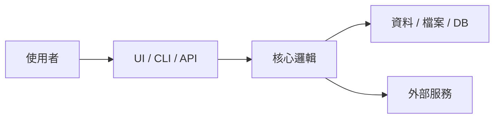

# Technical Design

## 1. 文件摘要

- 專案名稱：
- 版本：
- 日期：
- 文件狀態：草稿 / 已確認 / 待確認
- 參考文件：`project-brief.md`, `system-spec.md`

## 2. 技術目標

### 本設計要達成

### 本設計不處理

## 3. 系統型態與技術棧

| 項目 | 選擇 | 理由 | 替代方案 |
|---|---|---|---|
| 應用型態 | 待確認 | 待確認 | 待確認 |
| 語言 / Runtime | 待確認 | 待確認 | 待確認 |
| UI / CLI / API 框架 | 待確認 | 待確認 | 待確認 |
| 儲存方案 | 待確認 | 待確認 | 待確認 |
| 部署 / 執行環境 | 待確認 | 待確認 | 待確認 |

## 4. 架構摘要

## 5. 模組設計

| 模組 | 責任 | 輸入 | 輸出 | 依賴 |
|---|---|---|---|---|
| 待確認 | 待確認 | 待確認 | 待確認 | 待確認 |

## 6. 資料設計

### 主要實體

| 實體 | 說明 | 主要欄位 | 生命週期 |
|---|---|---|---|
| 待確認 | 待確認 | 待確認 | 待確認 |

### 資料保存與隱私

- 保存位置：
- 保存期限：
- 敏感資料：
- 刪除方式：

## 7. 介面契約

### UI / CLI / API

| 編號 | 介面 | 輸入 | 輸出 | 驗證 | 錯誤 |
|---|---|---|---|---|---|
| IF-001 | 待確認 | 待確認 | 待確認 | 待確認 | 待確認 |

## 8. 錯誤處理

| 情境 | 系統行為 | 使用者可見結果 | 記錄 / 告警 |
|---|---|---|---|
| 空資料 | 待確認 | 待確認 | 待確認 |
| 錯誤輸入 | 待確認 | 待確認 | 待確認 |
| 外部服務失敗 | 待確認 | 待確認 | 待確認 |
| 權限不足 | 待確認 | 待確認 | 待確認 |

## 9. 設定與 Secrets

| 項目 | 來源 | 是否敏感 | 預設值 | 說明 |
|---|---|---|---|---|
| 待確認 | `.env` / config / CLI | 是 / 否 | 待確認 | 待確認 |

## 10. 測試策略

| 類型 | 範圍 | 工具 / 方法 | 完成條件 |
|---|---|---|---|
| Unit | 待確認 | 待確認 | 待確認 |
| Integration | 待確認 | 待確認 | 待確認 |
| UI / E2E | 待確認 | 待確認 | 待確認 |
| Manual Acceptance | 待確認 | 待確認 | 待確認 |

## 11. 執行、部署與維護

- 本機啟動：
- 建置：
- 測試：
- 部署：
- Log 位置：
- 常見故障處理：

## 12. 技術決策

| ADR | 決策 | 理由 | Trade-off | 狀態 |
|---|---|---|---|---|
| ADR-001 | 待確認 | 待確認 | 待確認 | Proposed |

## 13. 待確認事項

| 編號 | 問題 | 影響 | 建議確認時機 |
|---|---|---|---|
| Q-001 | 待確認 | 待確認 | 開發前 |
