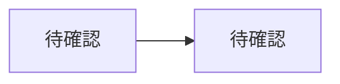
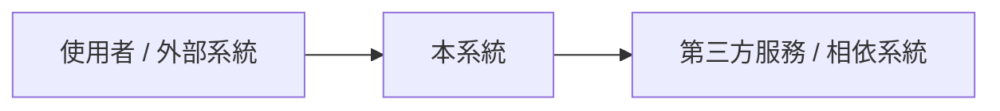
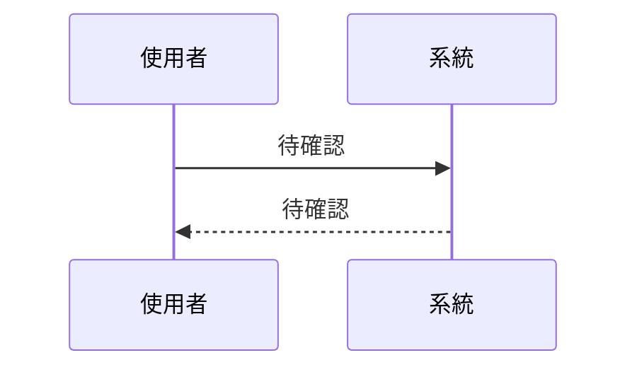
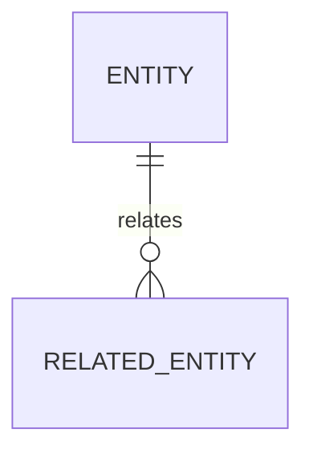

# 系統規格書模板

> 使用此模板產出整合型系統規格書。若使用者要求正式 SRS，可強化需求編號、驗收條件與追蹤矩陣；若要求技術設計，可強化架構、資料流、API、容量與 failure modes。

## 1. 文件摘要

- 系統 / 功能名稱：
- 文件版本：
- 日期：
- 目標讀者：
- 來源依據：
- 文件狀態：草案 / 待確認 / 已確認

### 修訂紀錄

| 版本 | 日期 | 作者 / Owner | 變更摘要 | 狀態 |
|---|---|---|---|---|
| v0.1 | 待確認 | 待確認 | 初版 | 草案 |

### 文件慣例與讀者指引

- 需求 ID 規則：`FR-001`、`NFR-001`、`API-001`、`AC-001`
- 優先級規則：Must / Should / Could / Won't
- 建議閱讀順序：
- 權威來源連結：OpenAPI / Swagger、Figma、ADR、Runbook、資料庫 schema、既有文件

## 2. 背景與目標

### 背景

### 目標

### 非目標

### 產品視角與主要功能

## 3. 範圍

### In Scope

### Out of Scope

### 依賴與限制

### 操作環境

- 前端 / 客戶端：
- 後端 / 執行環境：
- 資料庫 / 儲存：
- 第三方服務：
- 裝置 / 硬體：
- 網路 / 通訊：

### 使用者文件

## 4. 角色與使用情境

| 角色 | 目標 | 主要情境 | 權限 / 限制 |
|---|---|---|---|
| 待確認 | 待確認 | 待確認 | 待確認 |

### 刺激 / 回應序列

| 情境 | 使用者或外部系統動作 | 系統回應 | 例外處理 |
|---|---|---|---|
| 待確認 | 待確認 | 待確認 | 待確認 |

## 5. 功能需求

| 編號 | 需求 | 優先級 | 驗收條件 | 備註 |
|---|---|---|---|---|
| FR-001 | 待確認 | Must | 待確認 |  |

### 業務規則

| 編號 | 規則 | 適用角色 / 情境 | 對應需求 |
|---|---|---|---|
| BR-001 | 待確認 | 待確認 | 待確認 |

## 6. 非功能需求

| 類別 | 需求 | 指標 / 門檻 | 驗證方式 | 備註 |
|---|---|---|---|---|
| 效能 | 待確認 | 待確認 | 待確認 |  |
| 可用性 | 待確認 | 待確認 | 待確認 |  |
| 安全 | 待確認 | 待確認 | 待確認 |  |
| 維運 | 待確認 | 待確認 | 待確認 |  |
| 相容性 / 可攜性 | 待確認 | 待確認 | 待確認 |  |
| 可測試性 | 待確認 | 待確認 | 待確認 |  |

### 粗估容量 / Back-of-the-envelope

| 項目 | 假設 | 粗估 | 對設計的影響 |
|---|---|---|---|
| 流量 / QPS | 待確認 | 待確認 | 待確認 |
| 儲存量 | 待確認 | 待確認 | 待確認 |
| 讀寫比例 | 待確認 | 待確認 | 待確認 |
| 並發數 | 待確認 | 待確認 | 待確認 |

## 7. 系統架構

### 架構摘要

### 元件與責任

| 元件 | 責任 | 輸入 | 輸出 | 相依 |
|---|---|---|---|---|
| 待確認 | 待確認 | 待確認 | 待確認 | 待確認 |

### 資料流 / 流程

### Context Diagram

### Sequence Diagram

### 技術選型與理由

| 決策 | 選項 | 理由 | 替代方案 | 狀態 |
|---|---|---|---|---|
| 待確認 | 待確認 | 待確認 | 待確認 | 待確認 |

### 架構視角

| 視角 | 內容 | 主要讀者 | 重要決策 / 限制 |
|---|---|---|---|
| Application | 模組、流程、外部互動 | PM / Tech Lead / Engineer | 待確認 |
| Security | 身分、授權、資料保護、稽核 | Security / Backend / Ops | 待確認 |
| Sizing | 流量、容量、效能、成本 | Architect / SRE / Ops | 待確認 |
| Infrastructure | 部署、網路、服務、middleware | DevOps / SRE | 待確認 |
| Development | 程式碼結構、開發環境、測試策略 | Engineer | 待確認 |

### Architecture Decisions

| ADR | 決策 | 背景 | 結果 / Trade-off | 狀態 |
|---|---|---|---|---|
| ADR-001 | 待確認 | 待確認 | 待確認 | Proposed |

## 8. 資料模型

### 實體關係

| 實體 | 說明 | 關鍵欄位 | 關聯 | 生命週期 |
|---|---|---|---|---|
| 待確認 | 待確認 | 待確認 | 待確認 | 待確認 |

### 資料規則

### 保留、稽核與遷移

### ER Diagram

## 9. API / 介面規格

| 編號 | 方法 / 介面 | 路徑 / 名稱 | 說明 | Auth | Request | Response | 錯誤 |
|---|---|---|---|---|---|---|---|
| API-001 | 待確認 | 待確認 | 待確認 | 待確認 | 待確認 | 待確認 | 待確認 |

### 驗證規則

### Idempotency / Rate Limit / Versioning

### 外部介面需求

| 類別 | 介面 | 需求 | 權威來源 / 連結 |
|---|---|---|---|
| User Interface | 待確認 | 待確認 | 待確認 |
| Hardware Interface | 待確認 | 待確認 | 待確認 |
| Software Interface | 待確認 | 待確認 | 待確認 |
| Communications Interface | 待確認 | 待確認 | 待確認 |

## 10. 權限與安全

- 身分驗證：
- 授權模型：
- 資料敏感度：
- 稽核紀錄：
- Secrets / 金鑰管理：
- Abuse prevention：
- 合規要求：

## 11. 錯誤處理與例外流程

| 情境 | 觸發條件 | 系統行為 | 使用者可見結果 | 復原方式 |
|---|---|---|---|---|
| 待確認 | 待確認 | 待確認 | 待確認 | 待確認 |

## 12. 監控與維運

| 項目 | 指標 | 告警條件 | Runbook / 處理方式 |
|---|---|---|---|
| 待確認 | 待確認 | 待確認 | 待確認 |

### 部署與環境

### 備份與復原

### Failure Modes

| 失效情境 | 影響範圍 | 偵測方式 | 復原 / 降級策略 |
|---|---|---|---|
| 待確認 | 待確認 | 待確認 | 待確認 |

## 13. 驗收條件

| 編號 | 驗收項目 | 前置條件 | 步驟 | 預期結果 | 對應需求 |
|---|---|---|---|---|---|
| AC-001 | 待確認 | 待確認 | 待確認 | 待確認 | FR-001 |

## 14. 實作計畫

| 階段 | 交付項目 | 主要任務 | Owner | 依賴 | 驗收 |
|---|---|---|---|---|---|
| Phase 1 | 待確認 | 待確認 | 待確認 | 待確認 | 待確認 |

## 15. 風險與待確認事項

### 風險

| 風險 | 影響 | 可能性 | 緩解方式 | Owner |
|---|---|---|---|---|
| 待確認 | 待確認 | 待確認 | 待確認 | 待確認 |

### 待確認事項

| 編號 | 問題 | 影響範圍 | 建議決策期限 |
|---|---|---|---|
| Q-001 | 待確認 | 待確認 | 待確認 |

## 16. 追蹤矩陣

| 需求 | 使用情境 | API / 元件 | 驗收條件 | 測試 / 任務 |
|---|---|---|---|---|
| FR-001 | 待確認 | 待確認 | AC-001 | 待確認 |

## 17. 附錄

### Glossary

| 詞彙 | 定義 |
|---|---|
| 待確認 | 待確認 |

### Analysis Models

- Use case diagram：
- Class diagram：
- State transition diagram：
- Data-flow diagram：

### To Be Determined List

| TBD | 位置 | 需要決策 | Owner | 狀態 |
|---|---|---|---|---|
| TBD-001 | 待確認 | 待確認 | 待確認 | Open |
